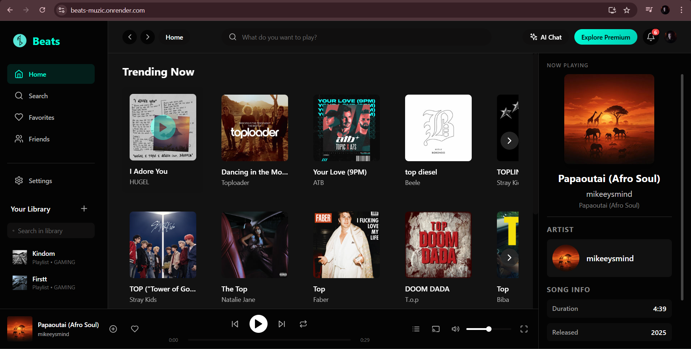
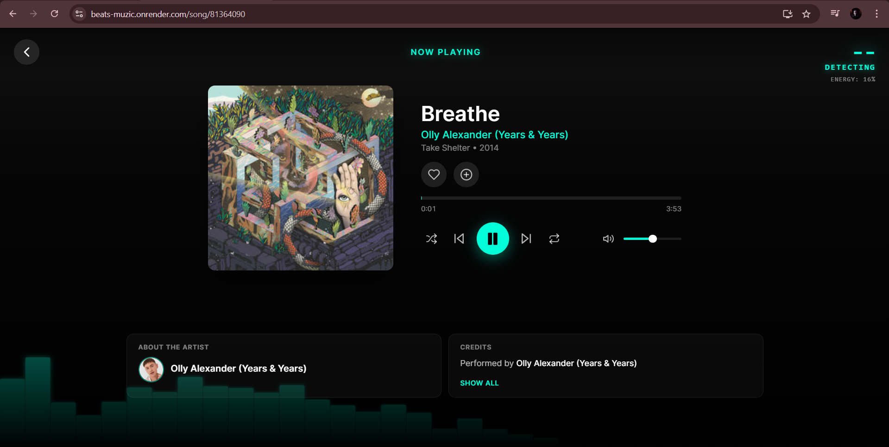
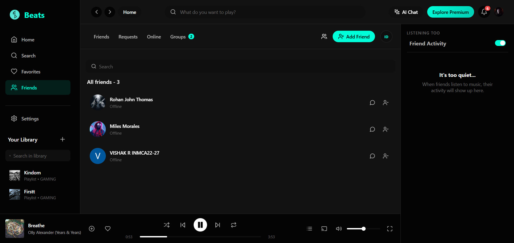
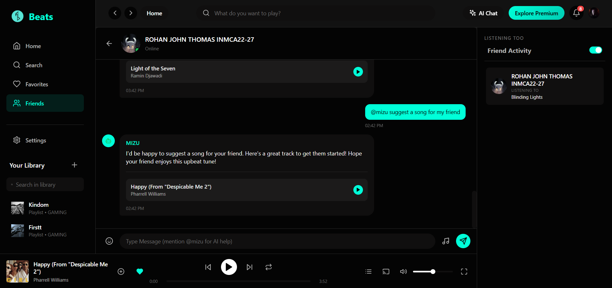
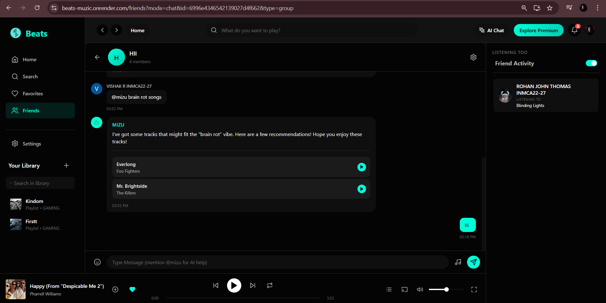
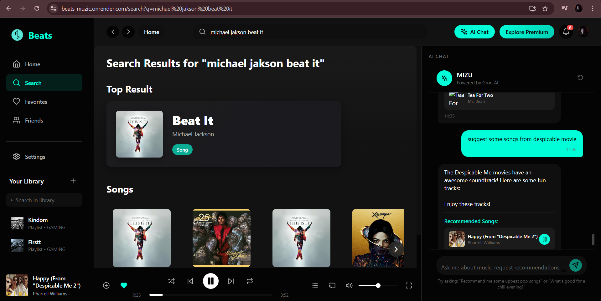
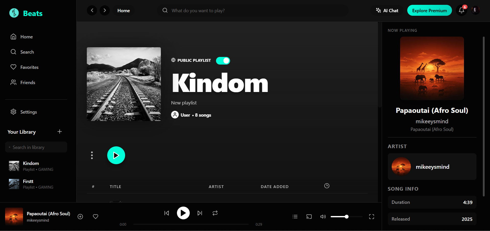
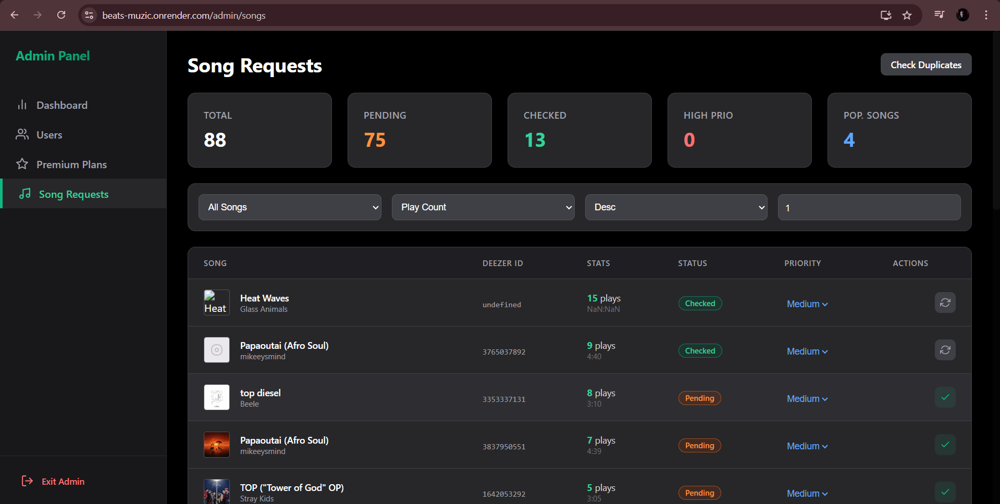

# Beats - Music Streaming & Social Application

**[🔴 Live Demo: beats-muzic.onrender.com](https://beats-muzic.onrender.com/)**

> **⚠️ Disclaimer:**
> **This is strictly a personal study and educational project.**
> This application was built solely for the purpose of learning full-stack web development, system architecture, and modern UI/UX design. All audio streams, images, and brand assets used within this application belong to their respective copyright holders. This project is not intended for commercial use, monetization, or public distribution.

## 🎵 About The Project

Beats is a comprehensive, full-stack music streaming platform designed with a modern, Apple Music-inspired user interface. It goes beyond simple playback by integrating realtime social features, allowing users to connect, share music, and listen together.

This project demonstrates the implementation of complex features including streaming audio handling, real-time bidirectional communication, authentication, state management, and responsive dynamic design.

### 📸 Gallery & Features

#### Home & Discovery
The home page features a dynamic hero section with lerp-based animations and personalized recommendations.

#### Advanced Audio Player
The application features a persistent, globally accessible audio player that handles queue management, background playback, and seamless track transitions.

#### Social & Real-time Chat
Users can add friends, see what their friends are currently listening to, and chat in real-time. The chat supports sharing music directly into conversations.

#### Group Interactions
Create groups, manage members, and share music with multiple friends at once.

#### Search & Library Management
Fast, debounced search functionality to explore the catalog and manage personal playlists.

#### Admin Dashboard
A secure administrative control panel for managing users, tracks, albums, and viewing platform statistics.

## 🏗️ Technical Architecture & Logic

The application follows a modern MERN-like stack (MongoDB, Express, React, Node.js) with several key architectural decisions:

### Frontend Logic (React + Vite)
- **State Management:** Utilizes a combination of React Context and Zustand/Redux for managing complex global states like the audio player queue and user authentication.
- **Audio Engine:** Implements a custom wrapper around the HTML5 Audio API to handle cross-browser streaming, playback persistence across route changes, and progress tracking.
- **Real-time UI:** Uses WebSocket listeners to dynamically update the UI for friend requests, incoming chat messages, and the "Listening To" activity status without polling.
- **Dynamic Styling:** Implements color-extraction logic from album art to dynamically style the player and page backgrounds, creating an immersive experience.
- **Routing:** Client-side routing with protected routes for authenticated users and role-based access control for the Admin Panel.

### Backend Logic (Node.js + Express)
- **Authentication:** JWT-based authentication flow with secure HTTP-only cookies and token refresh mechanisms to maintain sessions seamlessly.
- **Database Architecture:** MongoDB with Mongoose schemas designed for relational data (e.g., Users referencing Friends, Playlists referencing Songs).
- **Real-time Server:** Integrates Socket.io with the Express server for low-latency delivery of chat messages, typing indicators, and presence data.
- **Media Handling:** Implements secure upload logic (using Cloudinary or local gridfs) for user avatars, playlist covers, and audio files.
- **Rate Limiting & Security:** Includes basic security middleware to protect against common web vulnerabilities and control request rates.

---
*Built with ❤️ for listening to music.*
